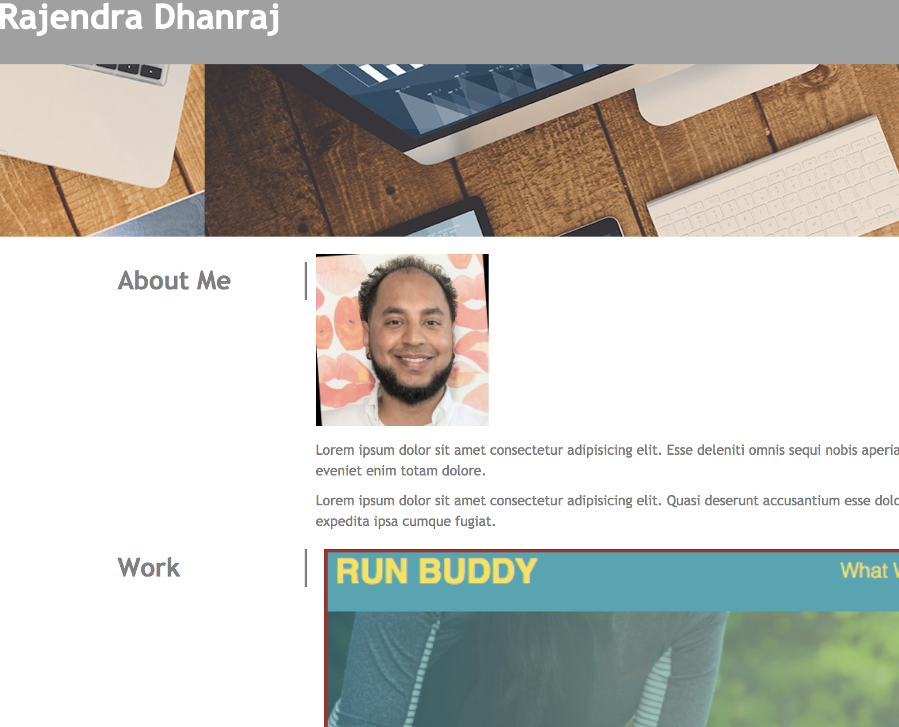

# Portfolio

# Table of Contents:
1. Purpose
2. Requirements
3. Screenshot
4. Link to Webpage:
5. License & Copyright

## Purpose

Build a web page that highlights HTML and CSS topics learnt in the current module such as: flex bos, grid, media queries.

## Requirements

_GIVEN I need to sample a potential employee's previous work_
_WHEN I load their portfolio_
_THEN I am presented with the developer's name, a recent photo, and links to sections about them, their work, and how to contact them_
_WHEN I click one of the links in the navigation_
_THEN the UI scrolls to the corresponding section_
_WHEN I click on the link to the section about their work_
_THEN the UI scrolls to a section with titled images of the developer's applications_
_WHEN I am presented with the developer's first application_
_THEN that application's image should be larger in size than the others_
_WHEN I click on the images of the applications_
_THEN I am taken to that deployed application_
_WHEN I resize the page or view the site on various screens and devices_
_THEN I am presented with a responsive layout that adapts to my viewport_

## Screenshot

## Link to deployed webpage

[Click to view Live Website](https://rajendra-dhanraj.github.io/Portfolio/ "Rajendra's Portfolio")

## License

MIT 